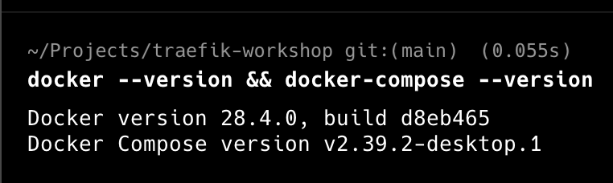

# Taller configuración Traefik

Integrantes:

- Sebastian Cañon
- Natalia Bernal

# Screenshots Natalia:

## Paso 1 - Verificar requisitos

## Paso 2 - Levantar Traefik

´

## Paso 3 - Dashboard de traefik

## Paso 4 - Desplegar aplicación de ejemplo(whoami)

## Paso 5 - Probar acceso a la aplicación

## Paso 6 - Revisar routers en la dashboard

# Screenshots Sebastián:

## Paso 1 - Verificar requisitos y versión de Docker

## Paso 2 - Levantar Traefik con Docker compose

´

## Paso 3 - Muestra del dashboard de Traefik

## Paso 4 - Desplegar el ejemplo de whoami

## Paso 5 - Mandar curl a la dirección de whoami

## Paso 6 - Revisar routers en la dashboard

## Preguntas

### Qué ventaja aporta enrutar por host (dominio) vs por puerto?

## Respuesta:

Enrutar por host simplifica la gestión de puertos , en este modo sólo se necesita trabajar con un único puerto (generalmente 80/443) y se distinguen los servicios por dominio, así es más fácil de recordar y manejar que el puerto específico de cada servicio (por ejemplo, api.localhost o whoami.localhost en lugar de localhost:3001 o localhost:8000).
Además, hace que las URLs sean más limpias, lo que mejora su funcionamiento con las políticas de cookies y CORS, y se ajusta a lo que los navegadores y usuarios esperan al asumir puertos estándar (80/443) sin tener que especificarlos. Esto reduce los problemas con firewalls o NAT, ya que solo se exponen los puertos comunes (80/443). 
También permite implementar reglas avanzadas de capa 7 (L7) basadas en el dominio, como aplicar middlewares (autenticación, limitación de tasa, encabezados) o enrutar de manera diferente según el host.

### Qué diferencia hay entre labels en los servicios y usar archivos de configuración?

## Respuesta:

La diferencia entre usar los labels en los servicios y archivos de configuración, está en que los labels forman parte de la configuración dinámica. Cuando levantamos un contenedor con esos labels, Traefik con el proovedor de Docker detecta todas esas reglas y crea routers y middlewares de manera automática. Esto, en la práctica es súper cómodo para para definir las reglas específicas de un servicio directamente con su definición en Docker compose. Los archivos como los treafik.yml, en cambio se usarn para la configuración estática y global del proxy.

### Cómo se entera Traefik de que había servicios nuevos?

## Respuesta:

Traefik se entera de que hay servicios nuevos porque escucha todos los eventos del socket de Docker y cuando se habilita ese proovedor, y se monta, Traefik recibe notificaciones en tiempo real de la creación, el boot y la parada de los contenedores, y también actualiza las reglas de manera dinámica sin que tenga que reiniciarse.